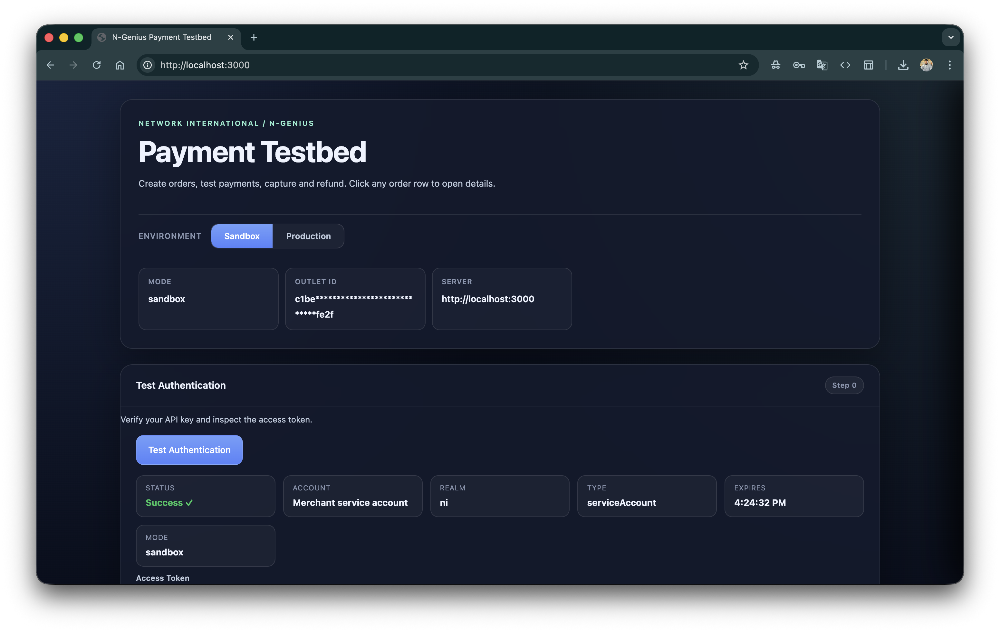

# N-Genius Payment Testbed

A local Node.js + Express developer tool for testing the [N-Genius Hosted Payment Page](https://developer.ngenius-payments.com/docs/hosted-payment-page) integration end-to-end — authentication, order creation, capture, refund, and order listing — all from a single browser UI.

Built for developers integrating [Network International / N-Genius](https://developer.ngenius-payments.com) who want a fast feedback loop without building a full application first.

---

## What's Inside

<p align="center">
  
</p>

| Feature | Description |
|---|---|
| **Environment toggle** | Switch between Sandbox and Production instantly |
| **Test Authentication** | Verify your API key and inspect the decoded JWT token |
| **Create orders** | AUTH, PURCHASE, and SALE — with full form control |
| **Hosted payment panel** | N-Genius pay page opens in a slide-in iframe panel |
| **Orders table** | Live list from the API or local browser history, paginated |
| **Order search** | Jump to any order by reference |
| **Capture** | Settle authorised (AUTH) payments with one click |
| **Refund** | Issue full or partial refunds from the order details panel |
| **Refund status** | Check the state of any submitted refund |
| **Sandbox test cards** | Built-in card numbers panel for quick reference |

---

## Quick Start

```bash
# 1. Clone and install
git clone https://github.com/AQaddora/ngenius-hosted-payment-testbed.git
cd ngenius-hosted-payment-testbed
npm install

# 2. Configure credentials
cp .env.example .env
# Open .env and fill in NGENIUS_API_KEY and NGENIUS_OUTLET_ID

# 3. Start
npm start
```

Open **http://localhost:3000** — the dashboard loads immediately.

> Need detailed setup instructions? See [docs/getting-started.md](docs/getting-started.md).

---

## Screenshots

### Test Authentication

Verify your API key and inspect the decoded JWT token — account name, realm, expiry, and the full token for use in direct API calls.

<p align="center">
  
</p>

---

### Create Order

Fill in amount, currency, action (AUTH / PURCHASE / SALE), email, and description. The hosted payment page opens in a slide-in panel automatically.

<p align="center">
  
</p>

---

### Orders & Sandbox Test Cards

Browse all outlet orders from the N-Genius API (or your local session history). CAPTURED, PURCHASED, REFUNDED — all states are colour-coded. Sandbox test card numbers are always one click away.

<p align="center">
  
</p>

---

## Documentation

Full developer documentation is in [docs/](docs/):

| Page | Description |
|---|---|
| [Getting Started](docs/getting-started.md) | Installation, environment setup, first run walkthrough, project structure |
| [Authentication](docs/authentication.md) | How N-Genius auth works, JWT claims, manual API access |
| [Creating Orders](docs/creating-orders.md) | Payment actions (AUTH/PURCHASE/SALE), form fields, amount conversion, localhost redirect handling |
| [Orders & Status](docs/orders.md) | Orders table, source toggle, pagination, order details panel, payment states |
| [Capture & Refund](docs/capture-refund.md) | Full lifecycle — AUTH → capture → refund, partial refunds, settlement requirements, step-by-step flows |
| [API Reference](docs/api-reference.md) | All server endpoints with request/response schemas and error codes |
| [Test Cards](docs/test-cards.md) | Sandbox card numbers, test scenarios, 3DS, webhook testing with ngrok/cloudflared |
| [Production](docs/production.md) | Go-live checklist, production configuration, deployment notes |

---

## Requirements

- **Node.js 18+**
- An N-Genius sandbox merchant account with:
  - A **Merchant Service Account API key**
  - An **Outlet ID** (outlet reference UUID)

> Get credentials from the [N-Genius Merchant Portal](https://merchant.ngenius-payments.com) under Settings → Integrations.

---

## Environment Variables

```env
PORT=3000
APP_BASE_URL=http://localhost:3000

# Sandbox
NGENIUS_BASE_URL=https://api-gateway.sandbox.ngenius-payments.com
NGENIUS_API_KEY=<your_sandbox_api_key>
NGENIUS_OUTLET_ID=<your_sandbox_outlet_id>

# Production (leave blank until go-live approval)
NGENIUS_PROD_BASE_URL=https://api-gateway.ngenius-payments.com
NGENIUS_PROD_API_KEY=
NGENIUS_PROD_OUTLET_ID=
```

> Never commit `.env` — it is excluded by `.gitignore`. Only `.env.example` (with empty values) belongs in version control.

---

## API Endpoints

| Method | Endpoint | Description |
|---|---|---|
| `GET` | `/api/health` | Server health and env config status |
| `GET` | `/api/config?env=sandbox` | Current config (masked values) |
| `GET` | `/api/test-auth?env=sandbox` | Test API key and return decoded JWT |
| `POST` | `/api/create-payment?env=sandbox` | Create a new payment order |
| `GET` | `/api/orders?env=sandbox` | List orders (paginated) |
| `GET` | `/api/orders/:reference?env=sandbox` | Get order by reference |
| `POST` | `/api/orders/:orderRef/payments/:paymentRef/captures` | Capture an authorised payment |
| `POST` | `/api/orders/:orderRef/payments/:paymentRef/captures/:captureId/refund` | Issue a refund |
| `GET` | `/api/orders/:orderRef/payments/:paymentRef/captures/:captureId/refund/:refundId` | Get refund status |

All endpoints accept `?env=sandbox` (default) or `?env=production`.

Full documentation with request/response schemas: [docs/api-reference.md](docs/api-reference.md)

---

## Sandbox Test Cards

| Scheme | PAN | Outcome |
|---|---|---|
| Visa | `4111111111111111` | Approved (00) |
| Visa | `4663295942784758` | Declined (05) |
| Mastercard | `5168441223630339` | Approved (00) |
| Mastercard | `5513935292057458` | Declined (05) |

Use any CVV and any future expiry. See [docs/test-cards.md](docs/test-cards.md) for full scenario coverage.

---

## Notes

- **Amount conversion:** the form accepts major units (e.g. `10.00 AED`); the server converts to minor units (fils/cents) before sending to N-Genius.
- **Access tokens:** a fresh token is requested for every API call. N-Genius tokens expire after 5 minutes.
- **Localhost redirect URLs:** N-Genius rejects `localhost` redirect URLs. The server automatically substitutes `https://example.com` for local testing. For real callbacks, use a tunnel — see [test-cards.md](docs/test-cards.md#testing-webhooks-locally).
- **Capture ID lookup:** for some N-Genius account types, capture IDs are not embedded in the order response. The testbed performs a secondary payment-level fetch to resolve them automatically.
- **Refund settlement:** N-Genius only allows refunds on settled transactions (end-of-day batch). In sandbox, this typically means the next day.
- **Orders list (production):** some production account configurations return 405 on the orders list endpoint. The testbed falls back to local session history automatically.

---

## Official N-Genius Documentation

| Resource | URL |
|---|---|
| Developer portal | [developer.ngenius-payments.com](https://developer.ngenius-payments.com) |
| Hosted Payment Page | [developer.ngenius-payments.com/docs/hosted-payment-page](https://developer.ngenius-payments.com/docs/hosted-payment-page) |
| API reference | [developer.ngenius-payments.com/reference](https://developer.ngenius-payments.com/reference) |
| Order states | [developer.ngenius-payments.com/docs/order-states](https://developer.ngenius-payments.com/docs/order-states) |
| Test cards | [developer.ngenius-payments.com/docs/test-cards](https://developer.ngenius-payments.com/docs/test-cards) |
| Webhooks | [developer.ngenius-payments.com/docs/webhooks](https://developer.ngenius-payments.com/docs/webhooks) |
| Merchant portal | [merchant.ngenius-payments.com](https://merchant.ngenius-payments.com) |
| Sandbox portal | [merchant.sandbox.ngenius-payments.com](https://merchant.sandbox.ngenius-payments.com) |
