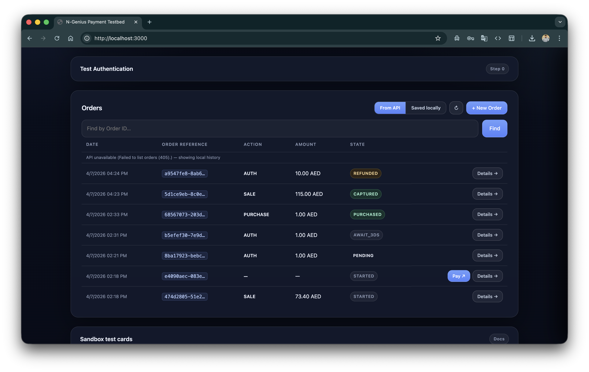

# Authentication

[← Getting Started](getting-started.md) | [Creating Orders →](creating-orders.md)

---

## How N-Genius Authentication Works

N-Genius uses a two-step authentication model:

```
Your API Key (Base64)
        │
        ▼
POST /identity/auth/access-token
        │
        ▼
JWT Access Token  ──►  used in every subsequent API call (Authorization: Bearer <token>)
```

1. Your **API key** is a Base64-encoded credential obtained from the Merchant Portal
2. You exchange it for a short-lived **JWT access token** via the identity endpoint
3. Every API call (create order, capture, refund, etc.) uses that JWT as a Bearer token
4. Tokens expire after **5 minutes** — the testbed requests a fresh token for every API call

This means your API key is never sent to the N-Genius payment or transaction APIs directly — only to the identity endpoint.

> Official reference: [developer.ngenius-payments.com/docs/authentication](https://developer.ngenius-payments.com/docs/authentication)

---

## Test Authentication Panel

The **Test Authentication** section (Step 0) lets you verify your credentials before creating any orders.

<p align="center">
  
</p>

### How to use it

1. Select the target environment (**Sandbox** or **Production**) using the toggle at the top of the page
2. Expand the **Test Authentication** section
3. Click **Test Authentication**
4. On success, the panel shows:

| Field | Description |
|---|---|
| **Status** | `Success ✓` or `Failed: <error message>` |
| **Account** | The service account name from your N-Genius configuration |
| **Realm** | The identity realm your account belongs to |
| **Type** | Account classification (e.g. `serviceAccount`) |
| **Expires** | When the access token expires (always ~5 minutes from now) |
| **Mode** | `sandbox` or `live` — confirms which environment you are hitting |
| **Access Token** | The full JWT — copy it to use in direct API calls (Postman, curl, etc.) |

The raw JSON response is also shown below the table, including all JWT claims.

### What the JWT claims mean

| Claim | Key | Description |
|---|---|---|
| Account name | `given_name` | Your merchant service account label |
| Realm | `realm` | Identity realm (e.g. `ni`) |
| Client ID | `clientId` | Service account identifier |
| Account type | `for` | Always `serviceAccount` for API keys |
| Expiry | `exp` | Unix timestamp — multiply by 1000 for JS `Date` |
| Roles | `realm_access.roles` | Permissions granted to this account |
| Hierarchy refs | `hierarchyRefs` | Outlet/merchant hierarchy references |

---

## Using the Access Token Manually

The full JWT displayed in the **Access Token** field can be used directly in any HTTP client:

```bash
# curl example
curl -H "Authorization: Bearer <paste_token_here>" \
     -H "Accept: application/vnd.ni-payment.v2+json" \
     "https://api-gateway.sandbox.ngenius-payments.com/transactions/outlets/<outlet_id>/orders"
```

```javascript
// JavaScript fetch example
const response = await fetch(
  `https://api-gateway.sandbox.ngenius-payments.com/transactions/outlets/${outletId}/orders`,
  {
    headers: {
      'Authorization': `Bearer ${accessToken}`,
      'Accept': 'application/vnd.ni-payment.v2+json'
    }
  }
);
```

Remember: the token expires in 5 minutes. If you get a 401, click **Test Authentication** again to get a fresh one.

---

## Common Authentication Errors

| Error | Cause | Fix |
|---|---|---|
| `API key not set` | `NGENIUS_API_KEY` is empty in `.env` | Add your API key to `.env` and restart the server |
| `401 Unauthorized` | API key is wrong or revoked | Double-check the key in the Merchant Portal |
| `Failed to get N-Genius access token` | Network issue or wrong `NGENIUS_BASE_URL` | Confirm `NGENIUS_BASE_URL` points to the correct environment |
| `sandbox` shows when you expect `live` | Wrong base URL | Production must use `https://api-gateway.ngenius-payments.com` (no `sandbox`) |

---

## Server-Side Implementation

The testbed's authentication is implemented in [server.js](../server.js) in the `getAccessToken()` function (line 107). It is called internally before every outbound N-Genius API request — you never need to call it directly when using the testbed UI.

```javascript
// Simplified — see server.js for full implementation
async function getAccessToken(cfg) {
  const response = await fetch(`${cfg.baseUrl}/identity/auth/access-token`, {
    method: 'POST',
    headers: {
      accept: 'application/vnd.ni-identity.v1+json',
      authorization: `Basic ${cfg.apiKey}`,
      'content-type': 'application/vnd.ni-identity.v1+json'
    }
  });
  const json = await response.json();
  return json.access_token;
}
```

The JWT payload (middle segment) is Base64-decoded server-side to extract the claims shown in the Test Authentication panel — no external JWT library is needed since N-Genius tokens use standard Base64url encoding.

---

*[← Getting Started](getting-started.md) | [Creating Orders →](creating-orders.md)*
