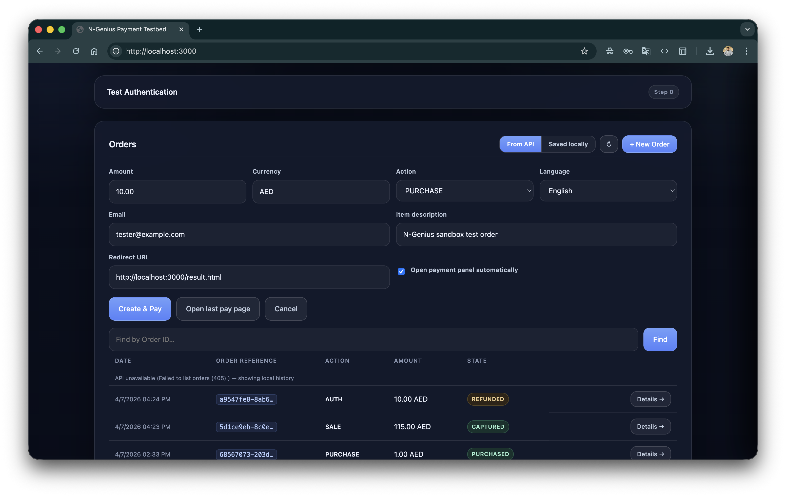

# Capture & Refund

[← Orders & Status](orders.md) | [API Reference →](api-reference.md)

---

## Payment Lifecycle

Understanding which actions are available depends on the **payment action** chosen when the order was created and the **current payment state**.

```
AUTH order:
  STARTED ──► AUTHORISED ──► CAPTURED ──► PARTIALLY_REFUNDED ──► REFUNDED
                    │               │
                 (void)         (refund full)
                 VOIDED          REFUNDED

PURCHASE / SALE order:
  STARTED ──► PURCHASED ──► PARTIALLY_REFUNDED ──► REFUNDED
                   │
               (refund full)
               REFUNDED
```

> Key difference: `PURCHASE`/`SALE` orders are **auto-captured** when the customer pays. `AUTH` orders hold funds — you must explicitly capture them before you can refund.

---

## Capture (AUTH orders only)

Capturing converts a reserved authorisation into a settled charge. You have a limited window (typically 7 days, check your contract) to capture before the authorisation expires.

### When can you capture?

State must be `AUTHORISED`.

### How to capture in the testbed

1. Click **Details →** on the order row (or click the row itself)
2. In the Order Details panel, the **Capture Payment** section appears when state = `AUTHORISED`
3. Confirm the amount and currency (pre-filled from the order)
4. Click **Capture**
5. On success, the status shows `Captured. ID: <captureId>` and the panel refreshes to state `CAPTURED`

<p align="center">
  
</p>

### Partial capture

Enter a smaller amount than the original order to do a partial capture. The remaining held funds are released automatically.

### What if capture fails with "already captured"?

`PURCHASE` and `SALE` orders auto-capture on payment — there is no separate capture step. If you see `invalidState`, skip directly to [Refund](#refund).

### Server-side implementation

```
POST /api/orders/:orderRef/payments/:paymentRef/captures?env=sandbox
Body: { "amount": "10.00", "currencyCode": "AED" }
```

The server calls `POST /transactions/outlets/<outletId>/orders/<orderRef>/payments/<paymentRef>/captures` on N-Genius and extracts the capture ID from the response's `_embedded['cnp:capture']` array. See [API Reference](api-reference.md) for full details.

---

## Refund

A refund credits the customer back — fully or partially. N-Genius processes refunds against a specific **capture**, so the capture ID is required.

### Requirements

| Requirement | Notes |
|---|---|
| State | `PURCHASED`, `CAPTURED`, or `PARTIALLY_REFUNDED` |
| Capture ID | Extracted automatically when you view order details |
| Settlement | The capture must be **settled** (end-of-day batch) before N-Genius allows a refund |

> **Important:** In the sandbox, transactions are typically settled overnight. If you try to refund immediately after capture, you will get `notRefundable`. Wait until the next day, or check if your sandbox account has same-day settlement enabled.

### How to issue a refund

1. Open the Order Details panel for a `PURCHASED` or `CAPTURED` order
2. The **Refund** section appears with the original amount pre-filled
3. For a **partial refund**: change the amount to a smaller value
4. Click **Refund**
5. On success: `Refund submitted. ID: <refundId>` — the panel refreshes to `PARTIALLY_REFUNDED` or `REFUNDED`
6. The refund ID is saved to `localStorage` for the **Refund Status** check

### Full vs Partial Refund

| Type | Amount entered | Resulting state |
|---|---|---|
| Full refund | Equal to captured amount | `REFUNDED` |
| Partial refund | Less than captured amount | `PARTIALLY_REFUNDED` |
| Additional partial | Issue again on `PARTIALLY_REFUNDED` order | `PARTIALLY_REFUNDED` → `REFUNDED` |

### What if the Capture ID is not shown?

For some N-Genius account configurations, the capture ID is not embedded in the order response. The testbed automatically performs a secondary lookup by fetching the payment object directly. If it still cannot find the capture ID, the panel shows:

> *"Capture ID not found yet — refresh after the capture settles."*

Click **↻ Refresh** in the panel header after a few seconds to try again.

### Server-side implementation

```
POST /api/orders/:orderRef/payments/:paymentRef/captures/:captureId/refund?env=sandbox
Body: { "amount": "10.00", "currencyCode": "AED" }
```

The server calls:
```
POST /transactions/outlets/<outletId>/orders/<orderRef>/payments/<paymentRef>/captures/<captureId>/refund
```

---

## Checking Refund Status

After a refund is submitted, you can check its current status using the **Refund Status** section in the Order Details panel.

This section appears when:
- The order state is `REFUNDED` or `PARTIALLY_REFUNDED`, **or**
- A refund ID is stored in `localStorage`

### How to check refund status

1. Open the Order Details panel for a refunded order
2. The **Refund Status** section appears at the bottom of the panel
3. The **Refund ID** field is pre-filled from `localStorage` if a refund was issued in this session
4. Paste a refund ID manually if needed
5. Click **Check status**
6. The raw refund object is shown — including state, amount, and timestamps

### Refund states

| State | Description |
|---|---|
| `REQUESTED` | Refund submitted but not yet processed |
| `ACCEPTED` | Refund accepted by the payment network |
| `SUCCESS` | Refund completed — funds returned to customer |
| `FAILED` | Refund failed — check the raw response for details |

> Official reference: [developer.ngenius-payments.com/docs/refunds](https://developer.ngenius-payments.com/docs/refunds)

---

## Common Errors

| Error | Cause | Fix |
|---|---|---|
| `invalidState` during capture | Order is `PURCHASED`/`SALE` — already auto-captured | Skip capture, go directly to Refund |
| `notRefundable` | Capture not yet settled (end-of-day batch) | Wait until next day and try again |
| `Capture ID not found` | N-Genius did not embed capture in order response | Click ↻ Refresh — the testbed retries the payment lookup |
| `Payment is not yet completed` | Trying to refund a `STARTED` order | Wait for customer to complete payment first |

---

## Step-by-Step: Full AUTH → Capture → Refund Flow

1. **Create order** with Action = `AUTH`
2. **Complete payment** on the hosted page with a [test card](test-cards.md)
3. Order state → `AUTHORISED`
4. Open **Details →** → click **Capture** → confirm state → `CAPTURED`
5. *(Wait for settlement — next day in sandbox)*
6. Open **Details →** → click **Refund** → confirm amount → state → `REFUNDED`
7. Open **Details →** → **Refund Status** → paste refund ID → click **Check status**

---

## Step-by-Step: PURCHASE → Refund Flow

1. **Create order** with Action = `PURCHASE`
2. **Complete payment** on the hosted page
3. Order state → `PURCHASED`
4. *(Wait for settlement — next day in sandbox)*
5. Open **Details →** → click **Refund** → confirm amount → state → `REFUNDED`

---

*[← Orders & Status](orders.md) | [API Reference →](api-reference.md)*
