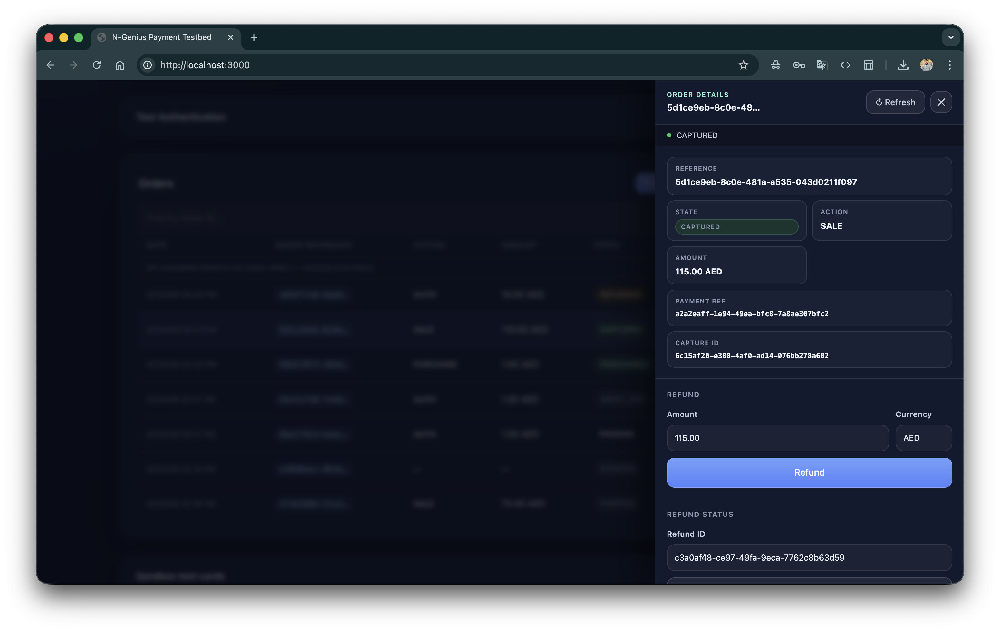

# Creating Orders

[← Authentication](authentication.md) | [Orders & Status →](orders.md)

---

## Overview

An **order** in N-Genius represents a payment intent. When you create an order, N-Genius returns a hosted payment page URL. The customer is redirected to that URL to enter their card details. The testbed handles the full flow from form submission to payment completion.

> Official reference: [developer.ngenius-payments.com/docs/create-order](https://developer.ngenius-payments.com/docs/create-order)

---

## New Order Form

Click **+ New Order** in the Orders section header to expand the form.

<p align="center">
  
</p>

### Form Fields

| Field | Name | Description | Example |
|---|---|---|---|
| **Amount** | `amount` | Payment amount in **major units** (the server converts to minor units automatically) | `10.00` |
| **Currency** | `currencyCode` | ISO 4217 currency code | `AED`, `USD`, `SAR` |
| **Action** | `action` | Payment action — see [Payment Actions](#payment-actions) below | `PURCHASE` |
| **Language** | `language` | Hosted page display language | `en` (English), `ar` (Arabic) |
| **Email** | `emailAddress` | Customer email — shown on the hosted page receipt | `tester@example.com` |
| **Item description** | `itemDescription` | Line item label shown on the hosted pay page | `N-Genius sandbox test order` |
| **Redirect URL** | `redirectUrl` | Where N-Genius sends the browser after payment | Auto-filled from `APP_BASE_URL` |
| **Open payment panel automatically** | — | If checked, the hosted pay page opens immediately in a slide-in panel | ✓ checked by default |

### Buttons

| Button | Action |
|---|---|
| **Create & Pay** | Submits the form, creates the order, opens the payment panel |
| **Open last pay page** | Re-opens the most recently created payment URL from `localStorage` |
| **Cancel** | Collapses the form without creating an order |

---

## Payment Actions

The **Action** field determines how funds are handled when the customer pays.

| Action | Behaviour | When to use |
|---|---|---|
| `PURCHASE` | Authorises **and** captures in a single step — funds are charged immediately | Standard e-commerce purchases |
| `AUTH` | Authorises (reserves) funds only — you must **Capture** later to collect | When you confirm shipment/delivery before charging |
| `SALE` | Alias for `PURCHASE` on most N-Genius configurations | Legacy or configuration-specific |

> For `AUTH` orders, see [Capture & Refund](capture-refund.md) for how to capture and refund them.

### State after creation

| Action | Initial payment state after creation |
|---|---|
| `PURCHASE` / `SALE` | `STARTED` → `PURCHASED` (after customer pays) |
| `AUTH` | `STARTED` → `AUTHORISED` (after customer pays) |

---

## What Happens When You Create an Order

1. The browser `POST`s the form to `/api/create-payment?env=sandbox`
2. The server requests a fresh access token from N-Genius
3. The server `POST`s to `/transactions/outlets/<outletId>/orders` with the order payload
4. N-Genius returns an order object including a `_links.payment.href` — the hosted page URL
5. The testbed stores the order reference and payment URL in `localStorage`
6. If **Open payment panel automatically** is checked, the hosted page opens in the right-side panel

### Amount conversion

The form accepts major units (e.g. `10.00 AED`). The server multiplies by 100 and rounds to convert to **minor units** (fils/cents) before sending to N-Genius:

```
10.00 AED  →  1000 fils
```

This means you always type human-readable amounts — the API conversion is handled transparently.

### Localhost redirect URL handling

N-Genius rejects `localhost` redirect URLs. When your `redirectUrl` contains `localhost` or `127.0.0.1`, the server automatically substitutes `https://example.com` in the payload sent to N-Genius. The result page still works because the order reference is stored in `localStorage` on the client.

For a real callback during local testing, use a tunnel — see [Test Cards — Testing Webhooks Locally](test-cards.md#testing-webhooks-locally).

---

## The Payment Panel

After order creation, the N-Genius hosted pay page opens in a slide-in panel on the right side of the screen.

| Element | Description |
|---|---|
| **Status bar** | Shows `Loading payment page…` → `Payment page ready` |
| **Check status** button | Closes the panel and opens the Order Details panel for this order |
| **✕** / overlay click | Closes the panel — the order still exists and can be found in the Orders table |

The panel monitors the iframe URL. When N-Genius redirects back to your origin (or `example.com`), the panel closes automatically and:
1. The Orders table refreshes
2. The Order Details panel opens for the completed order

---

## After Payment

Once the customer completes (or abandons) payment on the hosted page:

- The order appears in the **Orders** table with a state badge (`PURCHASED`, `AUTHORISED`, `FAILED`, etc.)
- Click **Details →** to open the Order Details panel
- From the panel you can: Capture (if `AUTHORISED`), Refund (if `PURCHASED`/`CAPTURED`), or re-open the payment page

See [Orders & Status](orders.md) for the full order lifecycle and state descriptions.

---

## API Payload Reference

The testbed sends this payload to `POST /transactions/outlets/<outletId>/orders`:

```json
{
  "action": "PURCHASE",
  "amount": {
    "currencyCode": "AED",
    "value": 1000
  },
  "emailAddress": "tester@example.com",
  "language": "en",
  "merchantAttributes": {
    "redirectUrl": "https://yourapp.com/result.html"
  },
  "paymentMethods": ["CARD", "APPLE_PAY", "SAMSUNG_PAY"],
  "categorizedOrderSummary": false,
  "orderSummary": {
    "total": { "currencyCode": "AED", "value": 1000 },
    "items": [
      {
        "description": "N-Genius sandbox test order",
        "quantity": 1,
        "totalPrice": { "currencyCode": "AED", "value": 1000 }
      }
    ]
  }
}
```

> See [API Reference](api-reference.md) for the full endpoint documentation.

---

*[← Authentication](authentication.md) | [Orders & Status →](orders.md)*
