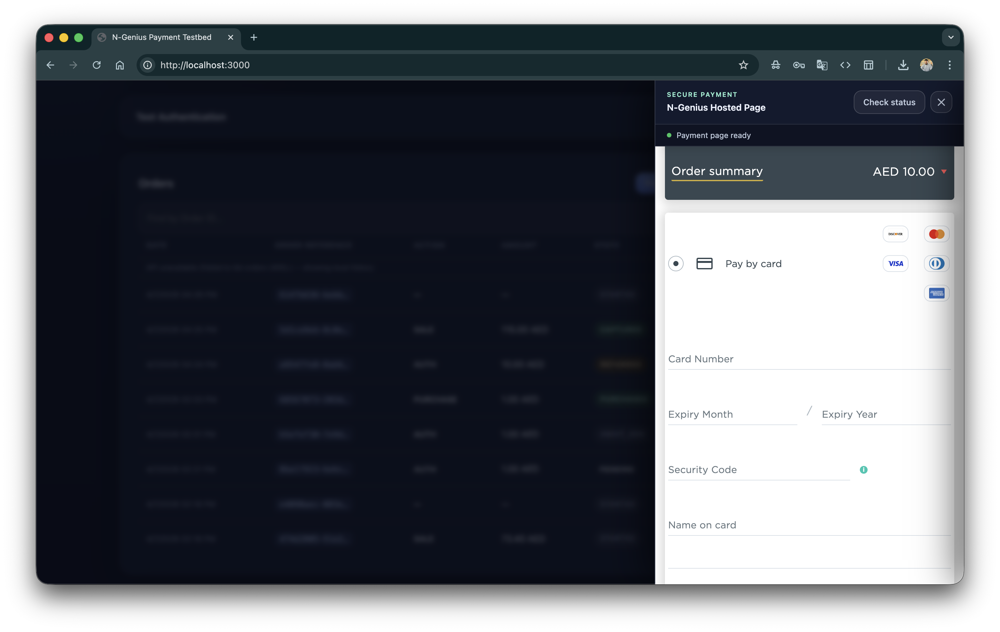

# Test Cards & Sandbox Testing

[← API Reference](api-reference.md) | [Production →](production.md)

---

## Sandbox Test Cards

Use these card numbers on the N-Genius hosted payment page in sandbox mode. Enter **any CVV** (e.g. `123`) and **any future expiry date** (e.g. `12/28`) unless your specific test case requires otherwise.

<p align="center">
  
</p>

| Scheme | PAN | Expected Outcome |
|---|---|---|
| Visa | `4111111111111111` | Approved (00) |
| Visa | `4663295942784758` | Declined (05) |
| Mastercard | `5168441223630339` | Approved (00) |
| Mastercard | `5513935292057458` | Declined (05) |

The test cards are also shown in the **Sandbox test cards** collapsible section at the bottom of the testbed dashboard.

> Official test card reference: [developer.ngenius-payments.com/docs/test-cards](https://developer.ngenius-payments.com/docs/test-cards)

---

## Test Scenarios

### Approved payment (PURCHASE)

1. Create an order with Action = `PURCHASE`
2. Enter `4111111111111111` / any CVV / any future expiry
3. Expected result: payment state → `PURCHASED`

### Declined payment

1. Create an order with any action
2. Enter `4663295942784758` or `5513935292057458`
3. Expected result: payment state → `FAILED`

### AUTH + Capture flow

1. Create an order with Action = `AUTH`
2. Enter `4111111111111111`
3. Expected result: state → `AUTHORISED`
4. Open Order Details → Capture
5. Expected result: state → `CAPTURED`

### AUTH + Capture + Refund flow

1. Complete the AUTH + Capture flow above
2. Wait for settlement (next day in sandbox)
3. Open Order Details → Refund
4. Expected result: state → `REFUNDED`

### Partial refund

1. Complete a PURCHASE or AUTH+Capture flow
2. Wait for settlement
3. Open Order Details → Refund → change amount to less than the original
4. Expected result: state → `PARTIALLY_REFUNDED`
5. Issue another refund for the remaining amount
6. Expected result: state → `REFUNDED`

---

## 3DS Testing

Some test card combinations trigger 3DS (3D Secure) authentication flows. The N-Genius hosted page handles 3DS automatically — no special handling is required in the testbed. The payment panel remains open during the 3DS challenge.

If the payment gets stuck at `AWAIT_3DS`, the challenge timed out. Refresh the order status and try again.

> For a full list of 3DS test scenarios and specific card ranges, see the [N-Genius developer portal](https://developer.ngenius-payments.com/docs/test-cards).

---

## Testing Webhooks Locally

N-Genius sends webhook notifications to a **publicly accessible URL** when payment states change. Since `localhost` is not accessible from the internet, you need a tunnel to receive webhooks during local development.

### ngrok

```bash
# Install: https://ngrok.com/download
ngrok http 3000
```

ngrok prints a public URL like `https://abc123.ngrok.io`. Use that as your `APP_BASE_URL`:

```env
APP_BASE_URL=https://abc123.ngrok.io
```

### Cloudflare Tunnel

```bash
# Install: https://developers.cloudflare.com/cloudflare-one/connections/connect-apps
cloudflared tunnel --url http://localhost:3000
```

### Registering your webhook URL

1. Log in to the [N-Genius Merchant Portal](https://merchant.ngenius-payments.com) (or sandbox portal)
2. Go to **Settings → Integrations → Webhooks**
3. Add your tunnel URL + endpoint path (e.g. `https://abc123.ngrok.io/webhook`)
4. Select the events you want to receive (e.g. `PAYMENT_CAPTURED`, `PAYMENT_REFUNDED`)
5. Save — N-Genius will send a test notification

> Official webhook guide: [developer.ngenius-payments.com/docs/webhooks](https://developer.ngenius-payments.com/docs/webhooks)

### Receiving webhooks in the testbed

The testbed does not include a webhook receiver endpoint by default. To add one, add a route in [server.js](../server.js):

```javascript
app.post('/webhook', express.json(), (req, res) => {
  console.log('[WEBHOOK]', JSON.stringify(req.body, null, 2));
  res.sendStatus(200);
});
```

---

## Sandbox vs Production Behaviour

| Behaviour | Sandbox | Production |
|---|---|---|
| Card payments | Test cards only — real cards are rejected | Real cards only |
| Settlement | Typically next-day batch | Depends on your contract |
| Refund availability | After settlement (next day) | After settlement |
| Webhook delivery | Delivered to registered URL | Delivered to registered URL |
| Portal | [merchant.sandbox.ngenius-payments.com](https://merchant.sandbox.ngenius-payments.com) | [merchant.ngenius-payments.com](https://merchant.ngenius-payments.com) |
| API base URL | `api-gateway.sandbox.ngenius-payments.com` | `api-gateway.ngenius-payments.com` |

---

*[← API Reference](api-reference.md) | [Production →](production.md)*
